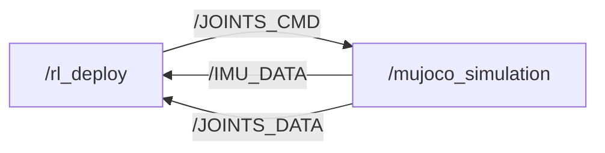

# M20 SDK Deploy

> **文档索引（M20 + Piper 部署）**：状态看 [`docs/review/`](../../docs/README_zh.md)——
> 待办 `review/TODO_zh.md`、已完成 `review/DONE_zh.md`、缺陷记录 `review/DEFECT_LOG_zh.md`、
> 开发/测试规范 `review/WORKFLOW_zh.md`；
> **接口契约**（观测/动作布局、关节顺序、坐标系、MuJoCo 参数）
> `docs/sim2sim_layout_contract_zh.md`。
> 改任何接口（关节顺序、坐标系、增益、观测维度）都必须同步更新契约文档。

[](https://discord.gg/gdM9mQutC8)
## Overview
This repository uses ROS2 to implement the entire Sim-to-sim and Sim-to-real workflow. Therefore, ROS2 must first be installed on your computer, such as installing [ROS2 Humble](https://docs.ros.org/en/humble/index.html) on Ubuntu 22.04. We've also released an introduction [video](https://www.youtube.com/watch?v=FNaxsDBtD7A), please check it out! Please go through the whole process on a Ubuntu system.

```bash
# ros2 topic list
/BATTERY_DATA
/IMU_DATA
/JOINTS_CMD
/JOINTS_DATA
/parameter_events
/rosout


# ros2 node info /mujoco_simulation 
/mujoco_simulation
  Subscribers:
    /JOINTS_CMD: drdds/msg/JointsDataCmd
  Publishers:
    /IMU_DATA: drdds/msg/ImuData
    /JOINTS_DATA: drdds/msg/JointsData
    /parameter_events: rcl_interfaces/msg/ParameterEvent
    /rosout: rcl_interfaces/msg/Log
  Service Servers:
    /mujoco_simulation/describe_parameters: rcl_interfaces/srv/DescribeParameters
    /mujoco_simulation/get_parameter_types: rcl_interfaces/srv/GetParameterTypes
    /mujoco_simulation/get_parameters: rcl_interfaces/srv/GetParameters
    /mujoco_simulation/list_parameters: rcl_interfaces/srv/ListParameters
    /mujoco_simulation/set_parameters: rcl_interfaces/srv/SetParameters
    /mujoco_simulation/set_parameters_atomically: rcl_interfaces/srv/SetParametersAtomically
  Service Clients:

  Action Servers:

  Action Clients:


# ros2 node info /rl_deploy 
/rl_deploy
  Subscribers:
    /BATTERY_DATA: drdds/msg/BatteryData
    /IMU_DATA: drdds/msg/ImuData
    /JOINTS_DATA: drdds/msg/JointsData
    /parameter_events: rcl_interfaces/msg/ParameterEvent
  Publishers:
    /JOINTS_CMD: drdds/msg/JointsDataCmd
    /parameter_events: rcl_interfaces/msg/ParameterEvent
    /rosout: rcl_interfaces/msg/Log
  Service Servers:
    /rl_deploy/describe_parameters: rcl_interfaces/srv/DescribeParameters
    /rl_deploy/get_parameter_types: rcl_interfaces/srv/GetParameterTypes
    /rl_deploy/get_parameters: rcl_interfaces/srv/GetParameters
    /rl_deploy/list_parameters: rcl_interfaces/srv/ListParameters
    /rl_deploy/set_parameters: rcl_interfaces/srv/SetParameters
    /rl_deploy/set_parameters_atomically: rcl_interfaces/srv/SetParametersAtomically
  Service Clients:

  Action Servers:

  Action Clients:

```
## Contribution 

Everyone is welcome to contribute to this repo. If you discover a bug or optimize our training config, just submit a pull request and we will look into it.
## Sim-to-sim

```bash
pip install "numpy < 2.0" mujoco
git clone https://github.com/DeepRoboticsLab/sdk_deploy.git

# Compile
cd sdk_deploy
source /opt/ros/<ros-distro>/setup.bash
colcon build --packages-up-to m20_sdk_deploy \
  --cmake-args -DBUILD_PLATFORM=x86 -DSIM2SIM=ON
```

`-DSIM2SIM=ON` selects the identity-calibration `M20SimInterface`, which is
required for this sim (the M20_Piper MJCF is already in the policy frame).

```bash
# Run (Open 2 terminals)
# Terminal 1
export ROS_DOMAIN_ID=1
source install/setup.bash
ros2 run m20_sdk_deploy rl_deploy

# Terminal 2 
export ROS_DOMAIN_ID=1
source install/setup.bash
python3 src/M20_sdk_deploy/interface/robot/simulation/mujoco_simulation_ros2.py
```

Notes for the M20_Piper sim:

- `mujoco_simulation_ros2.py` integrates the physics at 0.2 ms (5 substeps per
  1 ms control tick) because the USD-derived MJCF has a lightly damped ~500 Hz
  rocking mode that is numerically unstable at a plain 1 ms step. The topic
  rates and 200 Hz feedback are unchanged.
- The MJCF arm/wheel actuators now carry the same armature values as the Isaac
  Lab actuator configs (arm/gripper 0.01, wheel 0.00243216); without this the
  arm/gripper PD loop is unstable in MuJoCo.
- `M20PiperPolicyRunner` clamps raw ONNX actions to ±3 as a deployment safety
  net. This keeps commands bounded if the history encoder is pushed out of
  distribution, and prevents the previous wheel-position runaway/NaN.

### Control (Terminal 2)

<span style="color: red;">**Note:**</span>
> - Right click simulator window and select "always on top"
> - When the robot dog stands up, it may become stuck due to self-collision in the simulation. This is not a bug; please try again.
> - z： default position
> - c： rl control default position
> - wasd：forward/leftward/backward/rightward
> - qe：clockwise/counter clockwise

## Sim-to-sim with M20 + Piper arm (new RL policy)

This variant deploys the new Isaac Lab policy that controls the M20 legs/wheels
while a separate node drives the AgileX Piper arm through end-effector IK
(pyAgxArm MDH + DLS, matching the training's `DifferentialIKController`).

```
graph LR
    A["/rl_deploy"] -->|/JOINTS_CMD (16 legs)| B["/mujoco_simulation"]
    D["/arm_teleop (keyboard/VR hub)"] -->|/ARM_TELEOP| C["/arm_controller"]
    D -->|/reset_sim| B
    E["/vr_teleop (XLeVR)"] -->|/VR_TELEOP| A
    E -->|/VR_TELEOP| D
    C -->|/ARM_JOINTS_CMD (8 arm/gripper)| B
    B -->|/IMU_DATA, /JOINTS_DATA, /ARM_JOINTS_DATA| A
    B -->|/ARM_JOINTS_DATA| C
    C -->|/ARM_TELEOP_STATE (ee goal for obs)| A
```

The drdds messages are **unchanged** (16 joints); the arm uses separate topics,
so the same build stays compatible with the real M20 SDK path.

### Prerequisites

The policy is the `history_adaptation` run (rsl_rl `ActorCriticHistory`, an
RMA-style history encoder + actor). The deployment ONNX at
`policy/history_adaptation_full.onnx` contains encoder + actor:

- inputs: `obs` (86), `obs_history` (770 = 10 steps x 77)
- outputs: `actions` (23 = 12 leg pos + 4 wheel vel + 7 ee_ik, only the first
  16 are used for the M20 legs/wheels)

Policy obs (86): base angular velocity (3, x0.25), projected gravity (3),
velocity command (3), joint positions rel. default (22: 12 legs + 4 wheels
zeroed + 6 arm), joint velocities (22, x0.05), last action (23, processed),
ee goal (7: pos + quat wxyz), body pose (3: height/pitch/roll).

History step (77): raw base angular velocity (3), projected gravity (3),
joint positions rel. default (24, all joints in the USD order: arm first),
joint velocities (24), last action (23).

The original actor-only export (`policy/history_adaptation.onnx`) does not
contain the history encoder, so it cannot be deployed directly; regenerate the
full model with `scripts/export_history_policy_onnx.py` whenever you retrain.

`arm_controller.py` uses the Piper MDH table from `pyAgxArm` when installed and
falls back to an embedded copy otherwise.

添加宿主机图像传递
```
xhost +local:docker
```

创建容器
```
docker run -it \
    --name m20_piper_ros \
    --network host \
    --privileged \
    --gpus all \
    --env="DISPLAY=$DISPLAY" \
    --env="QT_X11_NO_MITSHM=1" \
    --env="MUJOCO_GL=glfw" \
    --volume="/tmp/.X11-unix:/tmp/.X11-unix:rw" \
    --volume="/home/eureka/code/m20_piper_sdk_deploy:/root/m20_piper_ws" \
    --workdir="/root/m20_piper_ws" \
    m20-piper-deploy:latest
```
进入容器
```
docker exec -it m20_piper_ros bash
```

### Run (teleop variant: 4 terminals, plus VR if needed)

```bash
# Terminal 1
export ROS_DOMAIN_ID=1
source install/setup.bash
source /opt/ros/humble/setup.bash
ros2 run m20_sdk_deploy rl_deploy

# Terminal 2
export ROS_DOMAIN_ID=1
source install/setup.bash
source /opt/ros/humble/setup.bash
python3 src/M20_sdk_deploy/interface/robot/simulation/mujoco_simulation_ros2.py

# Terminal 3
export ROS_DOMAIN_ID=1
source install/setup.bash
source /opt/ros/humble/setup.bash
python3 src/M20_sdk_deploy/interface/robot/simulation/arm_controller.py

# Terminal 4 (arm keyboard; required to move the arm)
export ROS_DOMAIN_ID=1
source install/setup.bash
python3 src/M20_sdk_deploy/interface/robot/simulation/arm_teleop_node.py
```

The arm is driven by the standalone `arm_teleop` hub, not by rl_deploy, so it
can be moved even before the legs enter RL mode. rl_deploy only reads the
`/ARM_TELEOP_STATE` EE goal for the policy observation.

### VR teleoperation (optional, Terminal 5)

```bash
# Terminal 5 (only when using the VR headset)
export ROS_DOMAIN_ID=1
source install/setup.bash
python3 src/M20_sdk_deploy/interface/robot/simulation/vr_teleop_node.py
```

Install the Python deps first (container):

```bash
pip3 install -r src/M20_sdk_deploy/requirements_teleop.txt
```

Open the printed `https://<ip>:8443` page in the headset browser. Press right B
to start and re-calibrate; left X/Y reset the simulation to its default pose
via the `/reset_sim` service.

### Simulation reset service

```bash
ros2 service call /reset_sim std_srvs/srv/Empty
```

Restores the robot to the default standing pose, zeroes velocities and clears
the leg/arm command buffers inside the MuJoCo node.

### Arm keyboard mapping (arm_teleop terminal)

- Numpad (NumLock ON): 8/2 EE x, 4/6 EE y, 7/9 EE z,
  1/3 EE roll, 0/. EE pitch, +/− EE yaw
- G: gripper open/close toggle
- L: reset body pose + arm teleop target

### Leg/body keyboard mapping (rl_deploy terminal)

- R/Z/C/X: joint damping / stand up / RL control / lie down
- WASD/QE: forward/back, left/right, turn left/right
- H/J: body height up/down; B/N: body pitch ±; `[`/`]`: body roll ±

When VR is active after pressing B, the arm hub follows the VR controller and
ignores keyboard arm keys, and rl_deploy follows VR for legs/body.

### M20+Piper real arm (sim2real transport)

On real hardware the same high-level nodes are used; only the arm transport
changes. The AgileX Piper is driven by the external `agx_arm_ros` workspace
(Jetson AGX Orin + CAN) instead of MuJoCo:

```bash
# 1. CAN + agx driver (external workspace, fast_mode for direct move_js servo)
source ~/agx_arm_ws/install/setup.bash
ros2 launch agx_arm_ctrl start_single_agx_arm.launch.py \
  can_port:=can0 arm_type:=piper effector_type:=agx_gripper fast_mode:=true

# 2. transport adapter (same ROS_DOMAIN_ID)
python3 src/M20_sdk_deploy/interface/robot/simulation/arm_real_adapter.py
```

`arm_real_adapter.py` maps `arm_joint1..6 + gripper_joint1/2` to the agx
`/control/joint_states` protocol (`joint1..6` raw rad + `gripper` width, with
width = q6 - q7) and maps `/feedback/joint_states` back into `/ARM_JOINTS_DATA`
so arm_controller and rl_deploy need no code change. The rest of the teleop
stack (arm_controller + arm_teleop + VR) is identical to the sim flow.


# Sim-to-Real
This process is almost identical to simulation-simulation. You only need to add the step of connecting to Wi-Fi to transfer data, and then modify the compilation instructions.Real-robot control is divided into keyboard mode and gamepad control mode. You need to modify the RemoteCommandType parameter in the main function to select the desired mode.


**Please first use the OTA upgrade function in the handle settings to upgrade the hardware to version 1.1.8. We require a sdk authentication code to activate the sdk mode. Please contact our technical support team to get this unique code for each robot.**


```bash

# computer and gamepad should both connect to WiFi
# WiFi: CA9B********
# Passward: 12345678 (If wrong, contact technical support)
# Note: If you are connected via the second WiFi, use 10.21.41.1 instead of 10.21.31.103
#       for ssh/scp below. It is the same robot, only the IP differs per WiFi network.

# scp to transfer files to quadruped (open a terminal on your local computer) password is ' (a single quote)
# Note: drdds is already installed on the robot under /opt/ros/foxy, so we only copy M20_sdk_deploy.
ssh user@10.21.31.103 'mkdir -p ~/M20_sdk_deploy/src'
scp -r ~/sdk_deploy/src/M20_sdk_deploy user@10.21.31.103:~/M20_sdk_deploy/src

# ssh connect for remote development, 
ssh user@10.21.31.103
cd M20_sdk_deploy
source /opt/ros/foxy/setup.bash #source ROS2 env
# Build only m20_sdk_deploy. Do NOT rebuild drdds on the robot —
# the version under /opt/ros/foxy is the one the robot's services use.
colcon build --packages-select m20_sdk_deploy --cmake-args -DBUILD_PLATFORM=arm


sudo su # Root
source /opt/ros/foxy/setup.bash #source ROS2 env
source /opt/robot/scripts/setup_ros2.sh
# Use the gamepad to enable SDK mode. Need authorization code, please contact technical support team.

# Run
source install/setup.bash
ros2 run m20_sdk_deploy rl_deploy

# exit sdk mode：
# Use the gamepad to enable SDK mode.
```

### ⌨️ Keyboard Control
- z： default position
- c： rl control default position
- x： lie down
- wasd：forward/leftward/backward/rightward
- qe：clockwise/counter clockwise

### 🎮 Gamepad Control
*(Note: When using the gamepad control function, please ensure that the Gamepad APP version is V1.5.11 or higher.)*


- L1： default position
- L2： rl control default position
- R1： lie down
- R2： joint damping
- Left joystick：forward/leftward/backward/rightward
- Right joystick：clockwise/counter clockwise
